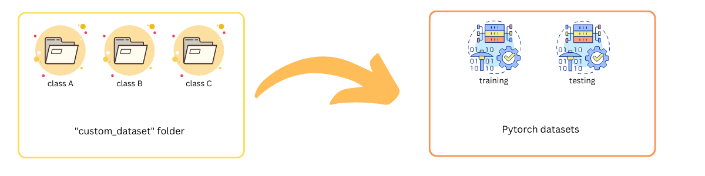

<a name="readme-top"></a>


<!-- PROJECT LOGO -->
<br />
<div align="center">
  <a href="https://github.com/othneildrew/Best-README-Template">
    
  </a>

  <h3 align="center">Pytorch-Custom-Dataset</h3>

  <p align="center">
    Create pytorch custom dataset in seconds.
    <br />
    <a href="https://github.com/max-ng/Pytorch-custom-dataset/blob/main/README.md"><strong>Explore the docs »</strong></a>
    <br />
</div>


<!-- ABOUT THE PROJECT -->
## About The Project



Minimize the time and learning curve to create a PyTorch custom dataset. Start with classification. Currently, the code supports .jpg .png .pdf .txt. Let's get started!

<p align="right">(<a href="#readme-top">back to top</a>)</p>


<!-- GETTING STARTED -->
## Getting Started

Create a Pytorch dataset for Classification:

1. Group the image/text files in a folder "custom_dataset" under the root folder. 

2. import:
  ```sh
  from pytorchdataset import CustomDataset
  ```

   ```sh
  train_dataset = CustomDataset(train=True)
  test_dataset = CustomDataset(train=False)
  ```

The samples are automatically split into a training set and a testing set. For text files, the text are split into into sentences. Each sentence is an input. 

### Installation

  ```sh
  pip install pytorch-custom-dataset
  ```
If you dont have 'en_core_web_sm' file, also install 
  ```sh
  python -m spacy download en_core_web_sm
 ```


<!-- USAGE EXAMPLES -->
## Usage

You group the data into subfolders. The labels are the name of subfolders. By default, 70% of the sampels are used as training data and 30% are testing data (by random). 

You can change the ratio for example:
  ```sh
  train_dataset = CustomDataset(train=True, ratio=0.5)
 ```

To use transform as usual: 
  ```sh
  train_dataset = CustomDataset(train=True, transform=YOUR_TRANSFORM)
 ```

To use it with other path: 
  ```sh
  train_dataset = CustomDataset(train=True, directory='ANOTHER_FOLDER')
 ```

<p align="right">(<a href="#readme-top">back to top</a>)</p>


<!-- ROADMAP -->
## Roadmap

- [x] Image, text classification
- [ ] Unlabeled dataset (for unsupervised learning)
- [ ] 
- [ ] 

<p align="right">(<a href="#readme-top">back to top</a>)</p>


<!-- CONTACT -->
## Contact

 maxnghello at gmail.com

Follow me on Medium: [@medium](https://twitter.com/your_username)

<p align="right">(<a href="#readme-top">back to top</a>)</p>


<!-- MORE -->
## More

More examples can be found [here](https://app.xxample.org/l/pytorch-pretrained). 


